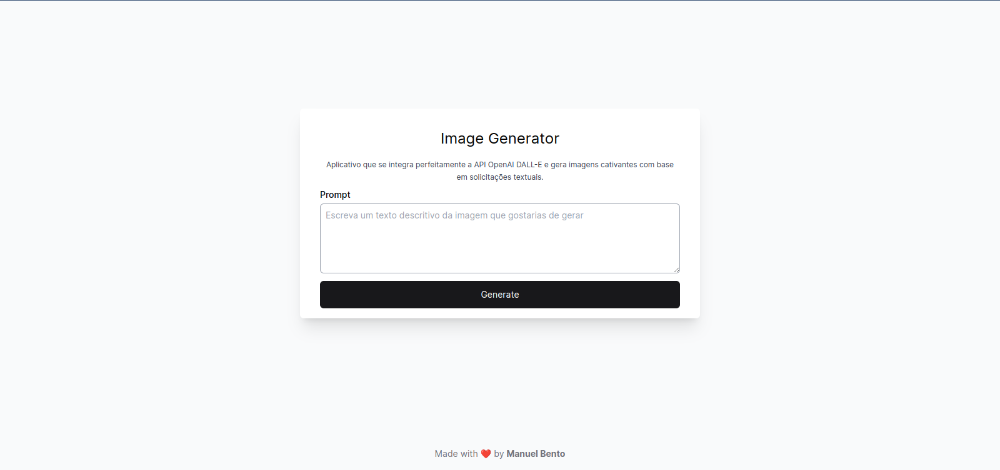

<h1 align="center">
  📸📝<br>Image Generator
</h1>
<p>Application that seamlessly integrates with the OpenAI DALL-E API and generates captivating images based on textual requests.
</p>




## 💼 Tecnologias utilizadas

Para o desenvolvimento deste site utilizei as seguintes tecnologias:
- Next.js
- React.js
- OpenAI
- Tailwind CSS

## 🚀 Getting started

### 1. Install

```bash
npm install
```

or

```bash
pnpm add
```

or

```bash
yarn add
```
### 2. Run

```bash
npm run start
```

or

```bash
pnpm start
```

or

```bash
yarn start
```
---
<h2>👨‍🚀 Autor</h2>

<table>
  <tr>
    <td>
      <a href="https://github.com/manuelbento19">
        <br>
        <sub>
          <b>Manuel Bento</b>
        </sub>
      </a>
    </td>
  </tr>
</table>
